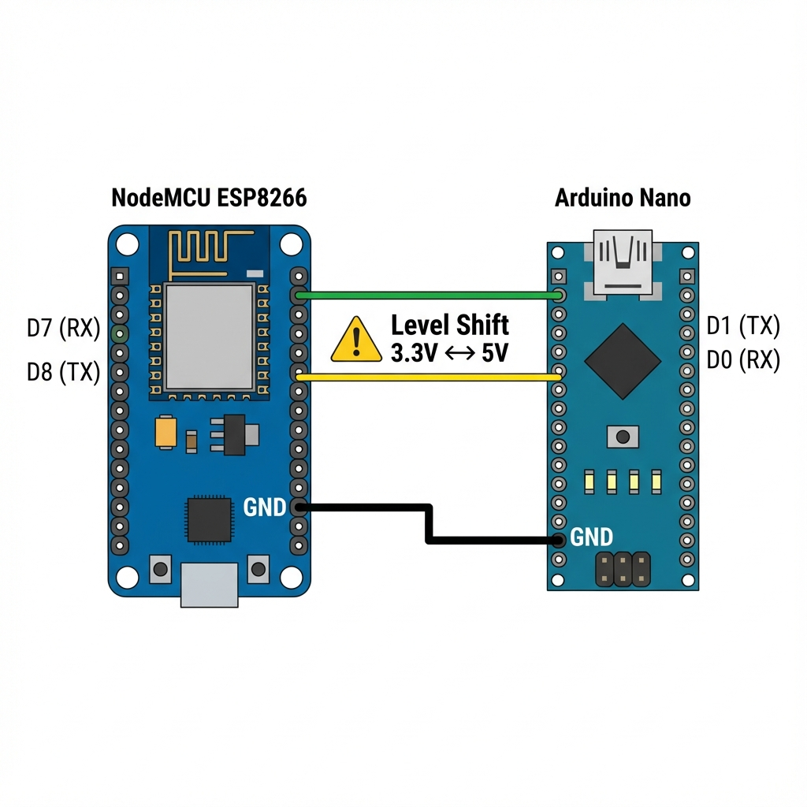

# ESP32 WebSocket 串口桥接 (客户端模式)

这个项目实现了一个ESP32 WebSocket串口桥接功能。ESP32作为WebSocket客户端连接到远程服务器，实现串口设备与远程服务器之间的双向透明通信。

## 功能特性

- ✅ **Web配置界面** - 首次启动时通过AP模式配置设备
- ✅ **WebSocket客户端** - 主动连接到配置的远程服务器
- ✅ **自动设备ID** - 基于MAC地址自动生成唯一ID (`esp32-XXXXXXXXXXXX`)
- ✅ **双向数据传输** - WebSocket ↔ Serial
- ✅ **配置持久化** - 使用NVS存储配置
- ✅ **自动重连** - WiFi和WebSocket断开自动重连
- ✅ **跨平台支持** - 支持 ESP32 和 ESP8266

## 硬件要求

- ESP32 或 ESP8266 开发板
- USB数据线（用于烧录和调试）
- 可选：连接到ESP32/ESP8266串口的其他MCU设备

## 硬件连接指南

本指南说明如何将 ESP32/ESP8266 连接到目标设备（以 Arduino Nano 为例）进行串口通信。

### 接线图



**注意：** 串口通信需要交叉连接（TX 接 RX，RX 接 TX），并且必须共地（GND 相连）。

| ESP32 / ESP8266 | Arduino Nano (目标设备) | 说明 |
| :--- | :--- | :--- |
| **RX** (GPIO 16 / D7) | **TX** (D1) | ESP 接收 Nano 发送的数据 |
| **TX** (GPIO 17 / D8) | **RX** (D0) | ESP 发送数据给 Nano |
| **GND** | **GND** | **必须连接**，共地参考 |
| **VIN / 5V** | **5V** | (可选) 如果共用电源 |

> [!WARNING]
> **电平匹配警告**
> - **ESP32/ESP8266** 的逻辑电平是 **3.3V**。
> - **Arduino Nano** 的逻辑电平通常是 **5V**。
> 
> 直接连接可能会损坏 ESP 芯片。建议在 **Nano TX -> ESP RX** 之间使用：
> 1. **逻辑电平转换器** (推荐)
> 2. 或 **分压电路** (例如：Nano TX 接 1kΩ 电阻 -> ESP RX -> 2kΩ 电阻 -> GND)
> 
> **ESP TX -> Nano RX** 通常可以直接连接，因为 3.3V 对 5V 逻辑通常被识别为高电平。

### 软件配置

1. **ESP32/8266**: 
   - 确保配置的波特率（默认 115200）与 Nano 一致。
   - 默认使用 `Serial2` (ESP32) 或 `SoftwareSerial` (ESP8266) ? 
   - **注意**: 当前代码默认使用主串口 `Serial` (USB 串口) 进行通信。
   - 如果需要连接外部设备，建议修改代码使用第二个硬件串口 (Serial2) 或软件串口，以免干扰 USB 调试和烧录。

   **针对当前代码 (使用主串口 Serial0) 的连接：**
   - 如果您直接使用板载 USB 接口连接电脑，则**不需要**上述接线，直接通过 USB 线即可与电脑通信。
   - 如果您想通过引脚连接 Nano，请注意 ESP32/8266 的 `TX0` 和 `RX0` 引脚通常与 USB 转串口芯片相连，直接连接可能会有冲突。
   - **推荐方案**：修改代码使用 `Serial2` (ESP32) 或 `SoftwareSerial` (ESP8266) 连接 Nano，保留 `Serial0` 用于调试打印。

   *(下个版本计划支持配置选择串口引脚)*

## 软件要求

- [PlatformIO](https://platformio.org/)
- Python 3.x（PlatformIO依赖）

## 快速开始

### 1. 构建项目

```bash
cd /home/master/works/ESP32-serial-web

# 构建 ESP32
make esp32

# 构建 ESP8266
make esp8266
```

### 2. 烧录到设备

```bash
# 烧录 ESP32
make upload-esp32

# 烧录 ESP8266
make upload-esp8266
```

### 3. 首次配置

首次烧录后，设备会自动进入配置模式：

1. **连接到设备热点**
   - SSID: `ESP32-Config`
   - 无密码

2. **打开配置页面**
   - 在浏览器中访问: `http://192.168.4.1`

3. **填写配置信息**
   - WiFi名称（SSID）
   - WiFi密码
   - WebSocket URL（例如: `ws://192.168.1.100:8080/ws/device`）
   - 串口波特率（默认115200）

4. **保存配置**
   - 点击"保存配置"按钮
   - 设备将在5秒后自动重启

### 4. 正常运行

配置完成后，设备会：
1. 连接到WiFi
2. 连接到配置的WebSocket服务器
   - 连接URL会自动附加设备ID参数: `?id=esp32-<MAC_ADDRESS>`
3. 开始透传串口数据

## 数据流

```
串口设备 ←→ ESP32 (WebSocket Client) ←→ 远程服务器 (WebSocket Server)
```

- **WebSocket → Serial**: 从服务器接收的数据会立即写入串口
- **Serial → WebSocket**: 从串口读取的数据会发送给服务器

## 项目结构

```
ESP32-serial-web/
├── src/
│   ├── main.cpp              # 主程序
│   ├── Config.cpp            # 配置管理实现
│   └── ConfigPortal.cpp      # 配置门户实现
├── include/
│   ├── Config.h              # 配置管理头文件
│   └── ConfigPortal.h        # 配置门户头文件
├── lib/                      # 本地库目录
├── test/                     # 测试代码
├── platformio.ini            # PlatformIO配置
├── websocket-test.html       # WebSocket测试工具
└── README.md                 # 本文档
```

## 依赖库

- `esphome/AsyncTCP-esphome` - 异步TCP库
- `ottowinter/ESPAsyncWebServer-esphome` - 异步Web服务器库
- `Preferences` - ESP32内置NVS存储库

## 配置管理

### 配置重置

- **代码重置**：在 `setup()` 中调用 `configManager.resetConfig()`
- **固件更新**：当刷入新版本的固件（配置版本变更）时，设备会自动重置配置，需要重新连接热点进行配置。
- **重新烧录**：手动清除NVS分区也会重置配置。

### 配置存储

配置保存在ESP32的NVS（非易失性存储）中，包括：
- WiFi SSID和密码
- WebSocket URL
- 串口波特率
- 配置状态标志

## 故障排除

### 无法进入配置模式

1. 确保是首次烧录或配置已被清除
2. 检查串口监视器输出
3. 手动清除NVS分区

### 无法连接到WiFi

1. 检查WiFi凭据是否正确
2. 确保ESP32在WiFi信号范围内
3. 查看串口输出的错误信息
4. 设备会在WiFi连接失败后自动进入配置模式

### WebSocket连接失败

1. 确认ESP32已成功连接到WiFi
2. 检查IP地址是否正确
3. 确保防火墙没有阻止80端口

### 串口数据丢失

1. 检查波特率设置是否匹配
2. 确认串口连接是否正确
3. 增加缓冲区大小（如果需要）

## 高级功能

### 远程WebSocket URL

配置中的"WebSocket URL"字段可用于：
- 记录远程服务器地址
- 未来扩展：ESP32作为WebSocket客户端连接到远程服务器

### 自动重连

ESP32会自动检测WiFi断开并尝试重连，每10秒尝试一次。

### 配置超时

配置模式会在30分钟后自动超时并重启设备，防止设备长时间停留在配置模式。

## 版本历史

### v2.3 (2025-11-25)
- ✨ 固件更新自动重置配置 (基于版本号检查)

### v2.2 (2025-11-25)
- 🔄 架构变更：从 WebSocket Server 切换为 WebSocket Client
- ✨ 自动生成设备 ID (基于 MAC 地址)
- ✨ 自动附加 ID 到 WebSocket URL

### v2.1 (2025-11-25)
- ✨ 增加 ESP8266 支持
- 🐛 修复跨平台编译问题

### v2.0 (2025-11-21)
- ✨ 新增Web配置界面
- ✨ 支持AP模式配置
- ✨ 配置持久化存储
- ✨ 自动WiFi重连
- ✨ 可配置串口波特率

### v1.0 (2025-11-21)
- 🎉 初始版本
- ✅ WebSocket串口桥接
- ✅ 基础功能实现

## 协议支持

本项目实现的是透明串口桥接，不对数据进行解析。如果需要支持特定的协议（如Beacon命令协议），可以在ESP32端添加协议解析逻辑。

## GitHub仓库

https://github.com/diablowu/ESP32-serial-web

## 许可证

本项目基于MIT许可证开源。

## 贡献

欢迎提交问题和拉取请求！
